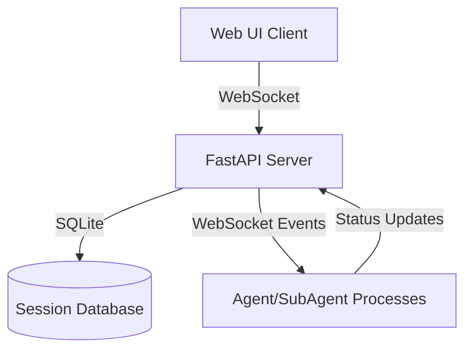
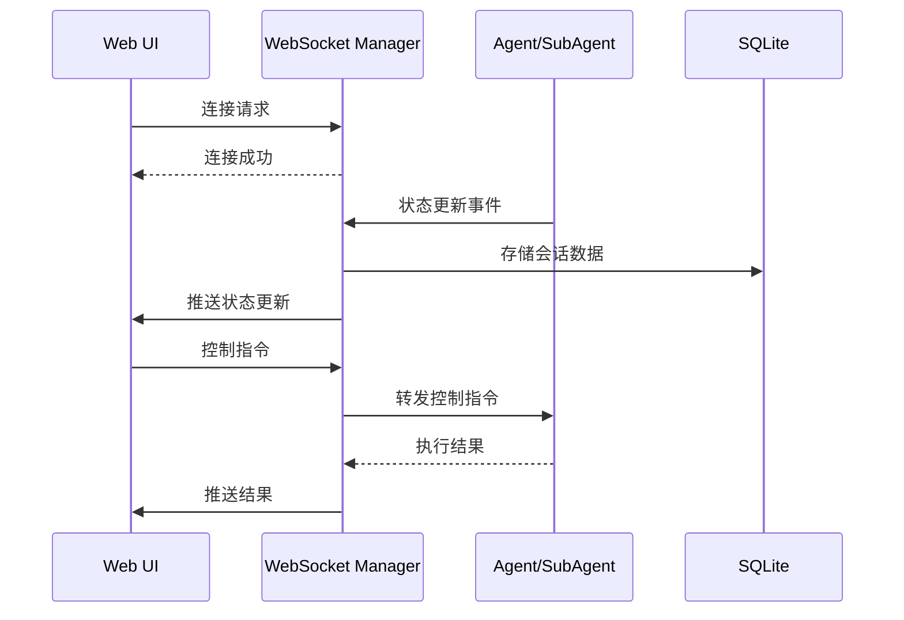

## Product Overview

为 Agent-SubAgent 系统构建一个现代化的 Web UI 界面，通过 FastAPI 后端提供 WebSocket 实时通信能力，实现对 Agent 和 SubAgent 的可视化管理与控制。

## Core Features

- 实时监控：WebSocket 推送 Agent/SubAgent 运行状态、日志流、任务执行进度
- 交互控制：支持暂停、恢复、干预正在运行的任务，发送控制指令
- 会话管理：查看历史会话记录、搜索过滤、导出会话数据
- 状态可视化：仪表盘展示系统架构图、各组件健康状态和性能指标
- 消息通信：实时查看 Agent 与 SubAgent 之间的消息传递

## Tech Stack

- **Backend**: Python + FastAPI + WebSocket + SQLite
- **Frontend**: React + TypeScript + Tailwind CSS
- **UI Components**: shadcn/ui
- **Real-time**: WebSocket 双向通信

## Architecture Design

### System Architecture

采用事件驱动架构，FastAPI 作为 WebSocket 服务器，前端通过 WebSocket 长连接接收实时数据推送。



### Module Division

- **WebSocket Manager Module**: 管理客户端连接、消息广播、心跳检测
- **Session Management Module**: SQLite 数据访问层，处理会话的 CRUD 操作
- **Event Router Module**: 路由 Agent/SubAgent 事件到对应的 WebSocket 客户端
- **Control Interface Module**: 处理用户的控制指令（暂停、恢复、干预）

### Data Flow



## Implementation Details

### Core Directory Structure

```
agent-web-ui/
├── backend/
│   ├── main.py                 # FastAPI 应用入口
│   ├── websocket/
│   │   ├── manager.py          # WebSocket 连接管理器
│   │   └── events.py           # 事件定义和处理器
│   ├── models/
│   │   ├── session.py          # 会话数据模型
│   │   └── agent.py            # Agent 状态模型
│   ├── services/
│   │   ├── session_service.py  # 会话管理服务
│   │   └── control_service.py  # 控制指令服务
│   └── database/
│       ├── db.py               # SQLite 连接配置
│       └── migrations/         # 数据库迁移文件
├── frontend/
│   ├── src/
│   │   ├── components/
│   │   │   ├── dashboard/      # 仪表盘组件
│   │   │   ├── monitor/        # 监控组件
│   │   │   ├── control/        # 控制面板组件
│   │   │   └── session/        # 会话管理组件
│   │   ├── hooks/
│   │   │   └── useWebSocket.ts # WebSocket 自定义 Hook
│   │   ├── services/
│   │   │   └── api.ts          # API 服务封装
│   │   └── types/
│   │       └── index.ts        # TypeScript 类型定义
│   └── package.json
└── requirements.txt
```

### Key Code Structures

**WebSocket Manager**: 管理活跃连接，支持广播和定向消息

```python
class ConnectionManager:
    def __init__(self):
        self.active_connections: Dict[str, WebSocket] = {}
    
    async def connect(self, client_id: str, websocket: WebSocket):
        await websocket.accept()
        self.active_connections[client_id] = websocket
    
    async def broadcast(self, message: dict):
        for connection in self.active_connections.values():
            await connection.send_json(message)
    
    async def send_to_client(self, client_id: str, message: dict):
        if client_id in self.active_connections:
            await self.active_connections[client_id].send_json(message)
```

**Session Model**: SQLite 数据模型定义

```python
class Session(Base):
    __tablename__ = "sessions"
    
    id = Column(String, primary_key=True)
    agent_id = Column(String, index=True)
    subagent_id = Column(String, nullable=True)
    status = Column(String)  # running, paused, completed, error
    messages = Column(JSON)  # 存储消息历史
    created_at = Column(DateTime, default=datetime.utcnow)
    updated_at = Column(DateTime, default=datetime.utcnow, onupdate=datetime.utcnow)
```

**WebSocket Hook**: React 自定义 Hook 管理 WebSocket 连接

```typescript
const useWebSocket = (url: string) => {
  const [socket, setSocket] = useState<WebSocket | null>(null);
  const [messages, setMessages] = useState<any[]>([]);
  const [connected, setConnected] = useState(false);
  
  useEffect(() => {
    const ws = new WebSocket(url);
    ws.onopen = () => setConnected(true);
    ws.onmessage = (event) => setMessages(prev => [...prev, JSON.parse(event.data)]);
    ws.onclose = () => setConnected(false);
    setSocket(ws);
    return () => ws.close();
  }, [url]);
  
  const send = (data: any) => socket?.send(JSON.stringify(data));
  
  return { connected, messages, send };
};
```

### Technical Implementation Plan

1. **问题**: 实现实时双向通信

- **解决方案**: 使用 FastAPI WebSocket 建立长连接，实现消息广播和定向发送
- **关键步骤**: 创建 ConnectionManager 类、定义事件协议、实现心跳机制
- **测试策略**: 模拟多客户端连接，验证消息传递的实时性和准确性

2. **问题**: 会话数据的持久化

- **解决方案**: 使用 SQLite 存储会话、消息和状态数据
- **关键步骤**: 定义 SQLAlchemy 模型、创建数据库表、实现 CRUD 操作
- **测试策略**: 验证数据一致性、并发写入处理

3. **问题**: 实时状态可视化

- **解决方案**: 前端使用 React + WebSocket 接收实时数据，使用 shadcn/ui 组件展示
- **关键步骤**: 设计仪表盘布局、实现实时日志流、状态指示器
- **测试策略**: 模拟高频消息更新，验证 UI 渲染性能

### Integration Points

- **WebSocket 协议**: JSON 格式消息，包含 event_type、data、timestamp 字段
- **REST API**: 提供会话查询、导出等非实时操作接口
- **Agent Integration**: 通过消息队列或进程间通信接收 Agent/SubAgent 事件

## Technical Considerations

### Performance Optimization

- 使用连接池管理 SQLite 连接
- WebSocket 消息批量推送，减少频繁通信
- 前端使用虚拟滚动处理大量日志数据

### Security Measures

- WebSocket 连接验证 token
- API 接口认证
- SQLite 数据库访问控制

### Scalability

- 支持水平扩展 FastAPI 实例
- 使用 Redis 存储活跃连接状态（未来扩展）
- SQLite 支持轻松迁移到 PostgreSQL/MySQL

## Design Style

采用深色科技风格，结合玻璃态和微光效果，打造专业的监控控制台界面。使用深蓝/灰色调作为主色，搭配霓虹青色作为强调色，营造现代感和科技感。

## Page Planning

1. **监控仪表盘**: 展示系统整体状态、Agent/SubAgent 数量、运行任务统计
2. **实时监控页面**: 显示 Agent 和 SubAgent 的实时日志流、状态变化、消息传递
3. **控制台页面**: 提供暂停、恢复、干预任务的交互控制面板
4. **会话管理页面**: 历史会话列表、搜索过滤、详情查看、数据导出
5. **架构视图页面**: 可视化展示 Agent-SubAgent 系统架构和组件关系

## Single Page Block Design

**监控仪表盘**:

- 顶部状态栏：显示系统健康度、活跃连接数、时间
- 统计卡片区域：4个卡片显示总任务数、运行中、已完成、错误数
- 实时活动区域：最近事件的时间线流
- 架构概览：简化的系统架构图

**实时监控页面**:

- 过滤栏：Agent/SubAgent 选择、日志级别筛选
- 状态面板：当前选中 Agent/SubAgent 的详细信息
- 日志流区域：实时滚动的日志消息，支持自动暂停
- 操作按钮：暂停、恢复、清空日志

## Responsive Design

- 桌面端：三栏布局，左侧导航、中间主内容、右侧详情面板
- 平板端：两栏布局，折叠导航
- 移动端：单栏布局，底部导航栏