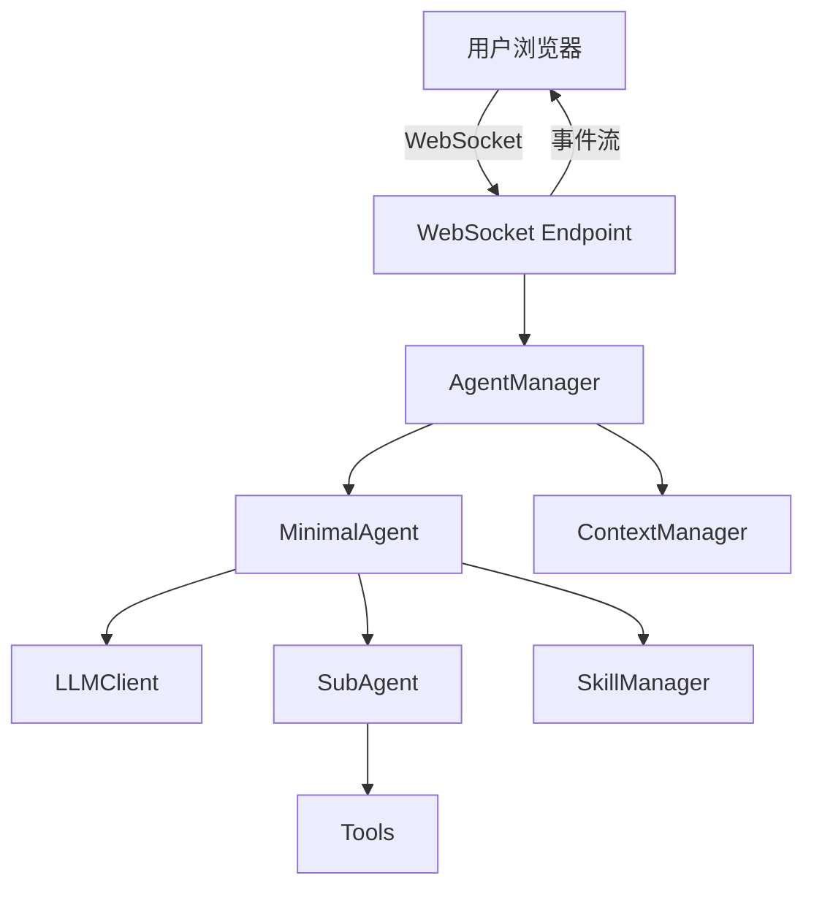
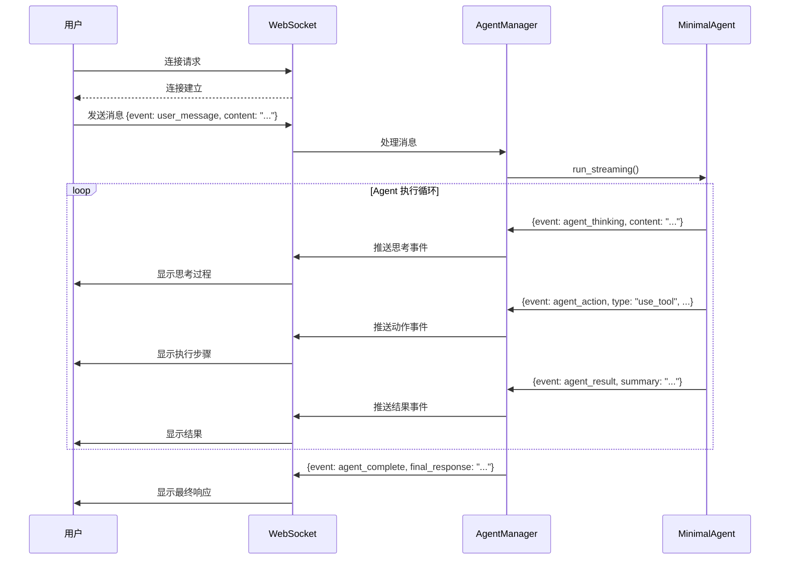

## 产品概述

为 agentic 项目添加实时交互式 Web UI，使用 FastAPI + WebSocket 实现后端服务，纯 HTML/CSS/JavaScript 实现前端页面。用户可以通过网页界面与 Agent 进行实时对话，并可视化查看 Agent 的思考过程、执行步骤和结果。

## 核心功能

- 实时对话：用户通过 WebSocket 发送消息，Agent 实时响应
- Agent 思考过程展示：显示 Agent 的推理过程（reasoning）
- 执行过程展示：显示工具/Skill/Chain 的执行状态和结果
- 结果可视化：格式化展示 Agent 的最终输出
- 多轮对话支持：保存会话上下文，支持连续对话
- 会话管理：创建新会话、查看历史记录

## 技术栈

### 后端

- **Web 框架**: FastAPI 0.109.0（已有依赖）
- **WebSocket**: websockets 12.0（已有依赖）
- **服务器**: uvicorn[standard] 0.27.0（已有依赖）
- **异步运行时**: asyncio

### 前端

- **HTML5**: 语义化结构
- **CSS3**: 响应式设计，自定义样式
- **JavaScript (ES6+)**: WebSocket 通信，动态渲染

### 已有组件

- agentic 核心：MinimalAgent、ContextManager、LLMClient

## 系统架构

### 整体架构



### 模块划分

1. **WebSocket 模块**

- WebSocket 连接管理
- 消息格式定义和验证
- 事件流传输

2. **AgentManager 模块**

- 管理 Agent 实例和会话
- 适配 run() 方法为流式输出
- 处理用户请求和响应

3. **前端模块**

- WebSocket 客户端
- 消息渲染
- 交互逻辑

### 数据流



## 实现细节

### 核心目录结构

```
agentic/
├── src/
│   ├── agent.py              # 现有 MinimalAgent（不变）
│   ├── llm.py                # 现有 LLMClient（不变）
│   ├── context.py            # 现有 ContextManager（不变）
│   ├── web_server.py         # 新增：FastAPI + WebSocket 服务器
│   └── stream_manager.py     # 新增：流式输出管理器
├── static/
│   ├── index.html            # 新增：前端页面
│   ├── styles.css            # 新增：样式文件
│   └── app.js                # 新增：前端逻辑
├── tools/                    # 现有工具
├── subagents/                # 现有 SubAgent
└── main_web.py               # 新增：Web 服务器入口
```

### 关键代码结构

**消息事件类型**

```python
# WebSocket 消息格式
{
    "event": "user_message" | "agent_thinking" | "agent_action" | 
            "agent_result" | "agent_complete" | "error",
    "content": "消息内容",
    "metadata": {...}  # 额外元数据
}
```

**StreamManager 类**

```python
class StreamManager:
    """流式输出管理器，适配 Agent.run() 为 WebSocket 流式输出"""
    
    async def stream_agent_run(self, agent: MinimalAgent, user_request: str, 
                             websocket: WebSocket, session_id: str)
        """执行 Agent 并流式输出事件到 WebSocket"""
```

**FastAPI WebSocket 端点**

```python
@app.websocket("/ws/{session_id}")
async def websocket_endpoint(websocket: WebSocket, session_id: str):
    """处理 WebSocket 连接和消息"""
    await websocket.accept()
    
    # 接收用户消息
    data = await websocket.receive_json()
    if data["event"] == "user_message":
        await stream_manager.stream_agent_run(
            agent, data["content"], websocket, session_id
        )
```

### 技术实现方案

1. **WebSocket 流式输出**

- 在 Agent.run() 的执行循环中，插入 WebSocket 推送逻辑
- 保留原有的 context 管理，同时通过 WebSocket 事件向前端推送实时状态
- 使用异步队列解耦 Agent 执行和 WebSocket 发送

2. **Agent 执行过程可视化**

- agent_thinking: 显示 Agent 的推理过程（reasoning）
- agent_action: 显示当前执行的 action（use_tool/use_skill/call_chain）
- agent_result: 显示执行结果

3. **前端设计**

- 聊天界面：显示用户消息和 Agent 响应
- 过程面板：实时展示 Agent 的思考和执行过程
- 响应式设计：支持桌面和移动端

### 集成点

- **WebSocket 端点**: `/ws/{session_id}`
- **静态文件服务**: `/static/` 路径下提供前端资源
- **现有 Agent**: 直接复用 MinimalAgent，无需修改核心逻辑
- **Context 持久化**: 使用现有的 ContextManager 自动保存机制

## 技术考虑

### 日志

- 使用 FastAPI 的日志系统记录 WebSocket 连接和消息
- 保留 Agent 原有的日志输出

### 性能优化

- WebSocket 连接复用，避免频繁建立连接
- 异步处理 Agent 执行和 WebSocket 发送
- 前端消息批量渲染，减少 DOM 操作

### 安全措施

- WebSocket 连接验证（可选 session_id）
- 输入长度限制，防止恶意输入
- 错误处理和异常捕获

### 可扩展性

- 支持多会话并发（每个 WebSocket 连接独立 session）
- 后续可添加会话历史查询、导出等功能
- 前端可集成更多可视化组件（如流程图、时间轴等）

## 设计风格

采用现代简约风格，以功能性和清晰度为核心。界面分为左右两栏：左侧为对话区域，右侧为 Agent 执行过程展示区域。

### 页面规划

**单页应用，包含以下区块：**

1. **顶部导航栏**

- Logo 和项目名称
- 会话管理按钮（新建会话、查看历史）

2. **主内容区 - 左右分栏布局**

- 左侧：对话区域（60%宽度）
    - 用户消息气泡（右侧对齐，蓝色）
    - Agent 响应气泡（左侧对齐，灰色）
    - 输入框和发送按钮
- 右侧：Agent 执行过程（40%宽度）
    - 思考过程展示（reasoning）
    - 执行步骤（actions）
    - 结果展示（results）
    - 使用时间轴样式展示执行流程

3. **底部状态栏**

- 会话 ID
- 连接状态指示器