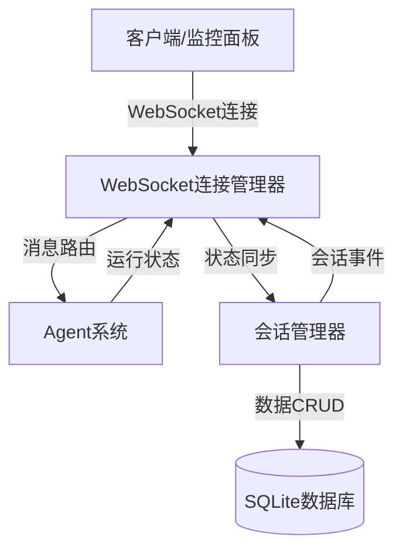
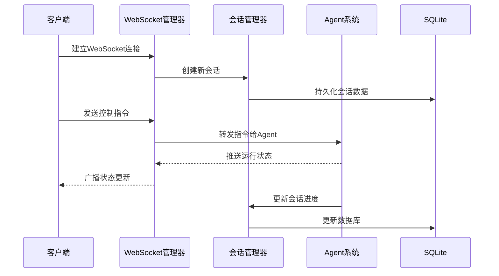

## Product Overview

将现有的 FastAPI 后端项目（基于 SQLite）与 Agent 系统集成，通过 WebSocket 实现实时监控和控制功能，确保会话数据能够持久化存储。

## Core Features

- WebSocket 连接管理：建立 FastAPI 与 Agent 系统之间的实时双向通信通道
- 会话数据持久化：将 Agent 会话数据存储到 SQLite 数据库，包括消息历史、状态信息
- 实时监控接口：提供 WebSocket 端点用于推送 Agent 运行状态、日志和中间结果
- 控制指令接收：通过 WebSocket 接收并处理对 Agent 的控制指令（暂停、恢复、停止等）
- 异步任务处理：使用 asyncio 实现高性能的异步消息处理和任务调度
- 数据库适配：设计 SQLite 适配的数据模型和存储逻辑，支持会话的创建、更新、查询和删除

## Tech Stack

- **后端框架**: Python FastAPI (异步支持)
- **数据库**: SQLite + SQLAlchemy (异步模式)
- **实时通信**: WebSocket (FastAPI 原生支持)
- **异步处理**: asyncio + aiofiles (文件操作)
- **数据处理**: Pydantic (数据验证)

## Tech Architecture

### System Architecture

采用事件驱动的异步架构，通过 WebSocket 建立 FastAPI 与 Agent 系统的实时连接，SQLite 负责会话数据的持久化存储。



### Module Division

- **WebSocket模块**: 管理客户端连接、消息广播、连接状态维护
- **会话管理模块**: 处理会话的创建、更新、状态转换，封装数据库操作
- **数据持久化模块**: SQLite 数据库模型定义和异步 CRUD 操作
- **Agent桥接模块**: 将 WebSocket 消息转换为 Agent 系统可识别的指令
- **事件处理器**: 处理 Agent 回调事件，通过 WebSocket 推送状态更新

### Data Flow



## Implementation Details

### Core Directory Structure

在现有 backend 项目结构上添加/修改：

```
backend/
├── app/
│   ├── api/
│   │   └── websocket.py          # 新增：WebSocket路由和端点
│   ├── core/
│   │   ├── websocket_manager.py   # 新增：WebSocket连接管理器
│   │   └── config.py              # 修改：添加WebSocket配置
│   ├── models/
│   │   └── session.py              # 新增：会话数据模型
│   ├── services/
│   │   ├── session_service.py     # 新增：会话业务逻辑
│   │   └── agent_bridge.py        # 新增：Agent系统桥接服务
│   └── schemas/
│       └── websocket.py           # 新增：WebSocket消息和会话schemas
├── database/
│   └── migrations/                # 新增：SQLite迁移脚本
└── main.py                        # 修改：注册WebSocket路由
```

### Key Code Structures

**WebSocketMessage Schema**: 定义客户端与服务器之间的消息格式

```python
class WebSocketMessage(BaseModel):
    type: Literal["control", "query", "status"]
    session_id: str
    data: Dict[str, Any]
    timestamp: datetime
```

**Session Model**: 会话数据的数据库模型

```python
class Session(Base):
    __tablename__ = "sessions"
    
    id: str = Column(String, primary_key=True)
    status: Column(Enum(SessionStatus))
    agent_type: Column(String)
    created_at: Column(DateTime, default=datetime.utcnow)
    updated_at: Column(DateTime, onupdate=datetime.utcnow)
    messages: relationship("Message")
```

**SessionService**: 会话管理的核心服务类

```python
class SessionService:
    async def create_session(self, agent_type: str) -> Session
    async def update_session_status(self, session_id: str, status: SessionStatus)
    async def append_message(self, session_id: str, message: Message)
    async def get_session_history(self, session_id: str) -> List[Message]
```

### Technical Implementation Plan

#### 1. WebSocket 连接管理

- **问题**: 需要高效管理多个客户端连接，支持消息广播
- **方案**: 使用 FastAPI 的 WebSocket 支持，实现连接管理器类
- **技术**: FastAPI WebSocket, asyncio.Queue
- **步骤**:

1. 创建 ConnectionManager 类维护活跃连接集合
2. 实现广播方法向所有连接发送消息
3. 实现私发方法向特定会话发送消息
4. 添加连接和断开的钩子函数

- **测试**: 模拟多客户端连接并发送消息，验证消息传递

#### 2. 会话数据持久化

- **问题**: SQLite 在高并发下可能存在锁竞争
- **方案**: 使用 SQLAlchemy 异步模式和连接池
- **技术**: SQLAlchemy (async), aiosqlite
- **步骤**:

1. 定义 Session 和 Message 的 SQLAlchemy 模型
2. 配置异步数据库引擎
3. 实现异步 CRUD 操作服务
4. 添加数据库迁移脚本

- **测试**: 压力测试并发读写操作

#### 3. Agent 系统集成

- **问题**: 需要将 WebSocket 消息映射到 Agent 的控制接口
- **方案**: 创建桥接服务层，封装 Agent API 调用
- **技术**: Python 异步调用，回调模式
- **步骤**:

1. 定义 Agent 指令枚举和消息格式
2. 实现 AgentBridge 服务类
3. 注册 Agent 事件回调处理器
4. 将回调事件通过 WebSocket 推送给客户端

- **测试**: 模拟 Agent 生命周期，验证状态同步

### Integration Points

- **数据库格式**: 使用 SQLAlchemy ORM 映射到 SQLite 表
- **WebSocket 协议**: JSON 格式消息，包含 type、session_id、data 字段
- **Agent 接口**: 通过函数调用或本地消息队列集成
- **认证**: 使用 WebSocket 查询参数传递 token，复用现有认证逻辑

## Agent Extensions

### Skill

- **code-explorer**
- Purpose: 探索 backend 目录结构和现有代码库
- Expected outcome: 了解当前 FastAPI 项目的组织方式、数据库配置和现有模型