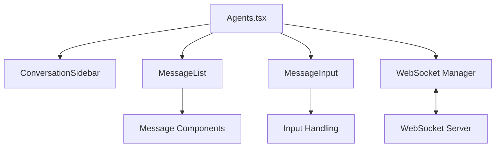

## Product Overview

修复 Agents.tsx 导出错误并重新实现对话式界面主页面，集成现有子组件以构建完整的聊天应用界面。

## Core Features

- 修复 Agents.tsx 组件导出错误
- 集成 ConversationSidebar、MessageList、MessageInput 组件
- 实现 WebSocket 实时消息通信
- 支持响应式布局（桌面端三栏布局，移动端自适应）
- 消息发送与接收功能
- 会话切换与消息历史展示

## Tech Stack

- Frontend: React + TypeScript
- Styling: Tailwind CSS
- Real-time Communication: WebSocket API
- State Management: React Hooks (useState, useEffect, useRef)

## Tech Architecture

### System Architecture

- Architecture pattern: Component-based architecture with WebSocket integration
- Component structure: Agents (Container) → Sidebar, MessageList, MessageInput (Presentational)



### Module Division

- **Agents Module**: Main container component managing layout and WebSocket connection
- **ConversationSidebar Module**: Session list display and selection
- **MessageList Module**: Message rendering and display
- **MessageInput Module**: Input handling and message sending
- **WebSocket Module**: Connection management and message routing

### Data Flow

User input → MessageInput → WebSocket send → Server process → WebSocket receive → MessageList update

## Implementation Details

### Core Directory Structure

```
src/
├── components/
│   ├── Agents.tsx              # New: Main container component
│   ├── ConversationSidebar.tsx # Existing
│   ├── MessageList.tsx         # Existing
│   └── MessageInput.tsx        # Existing
├── hooks/
│   └── useWebSocket.ts         # New: WebSocket hook
└── types/
    └── conversation.ts         # New: Type definitions
```

### Key Code Structures

**Message Interface**: Core message data structure

```typescript
interface Message {
  id: string;
  content: string;
  sender: 'user' | 'assistant';
  timestamp: Date;
}
```

**useWebSocket Hook**: WebSocket connection management

```typescript
function useWebSocket(url: string) {
  const [messages, setMessages] = useState<Message[]>([]);
  const [isConnected, setIsConnected] = useState(false);
  const wsRef = useRef<WebSocket | null>(null);
  
  const sendMessage = (content: string) => { /* ... */ };
  
  return { messages, sendMessage, isConnected };
}
```

### Technical Implementation Plan

1. **WebSocket Integration**: Implement reliable WebSocket connection with reconnection logic

- Use React hooks for connection management
- Handle connection states (connecting, connected, disconnected)
- Implement auto-reconnection on connection loss

2. **Component Integration**: Layout implementation

- Create responsive grid layout using Tailwind CSS
- Integrate existing components with proper props
- Handle state sharing between components

3. **Message Handling**: Message flow implementation

- User message → Send via WebSocket → Update UI
- Assistant message → Receive via WebSocket → Update UI
- Scroll to bottom on new message

### Integration Points

- **Component Props**: Messages, current conversation ID, send message function
- **Data Format**: JSON messages with id, content, sender, timestamp
- **WebSocket Endpoint**: ws://localhost:port/ws
- **State Management**: Context or props drilling for shared state

## Design Style

采用现代简约风格，类似 ChatGPT 和 Claude 的界面设计。桌面端为三栏布局（侧边栏、消息列表、输入区），移动端为单栏布局，支持侧边栏抽屉式切换。界面干净整洁，专注于对话内容，使用柔和的蓝灰色调，提供流畅的用户体验。

## Page Planning

**主页面 (Agents)**:

1. **顶部导航栏**: 包含应用标题、连接状态指示器、用户头像
2. **会话侧边栏 (ConversationSidebar)**: 左侧栏，显示会话列表，支持新建会话、切换会话、搜索会话
3. **消息列表区 (MessageList)**: 中间主要区域，显示当前会话的消息历史，支持滚动、自动定位到最新消息
4. **输入区域 (MessageInput)**: 底部固定区域，包含文本输入框、发送按钮，支持多行输入

## Single Page Block Design

- **顶部导航栏**: 水平布局，左侧应用标题，右侧状态和用户信息，高度 60px
- **会话侧边栏**: 垂直列表布局，宽度 280px（桌面），全屏抽屉（移动），展示会话标题和预览
- **消息列表区**: 垂直滚动布局，主内容区，消息气泡样式区分用户和助手
- **输入区域**: 固定底部，包含多行文本框和发送按钮，自适应高度

## Agent Extensions

### SubAgent

- **code-explorer**
- Purpose: 探索现有组件代码结构和接口定义
- Expected outcome: 获取 ConversationSidebar、MessageList、MessageInput 组件的 props 接口和使用方式