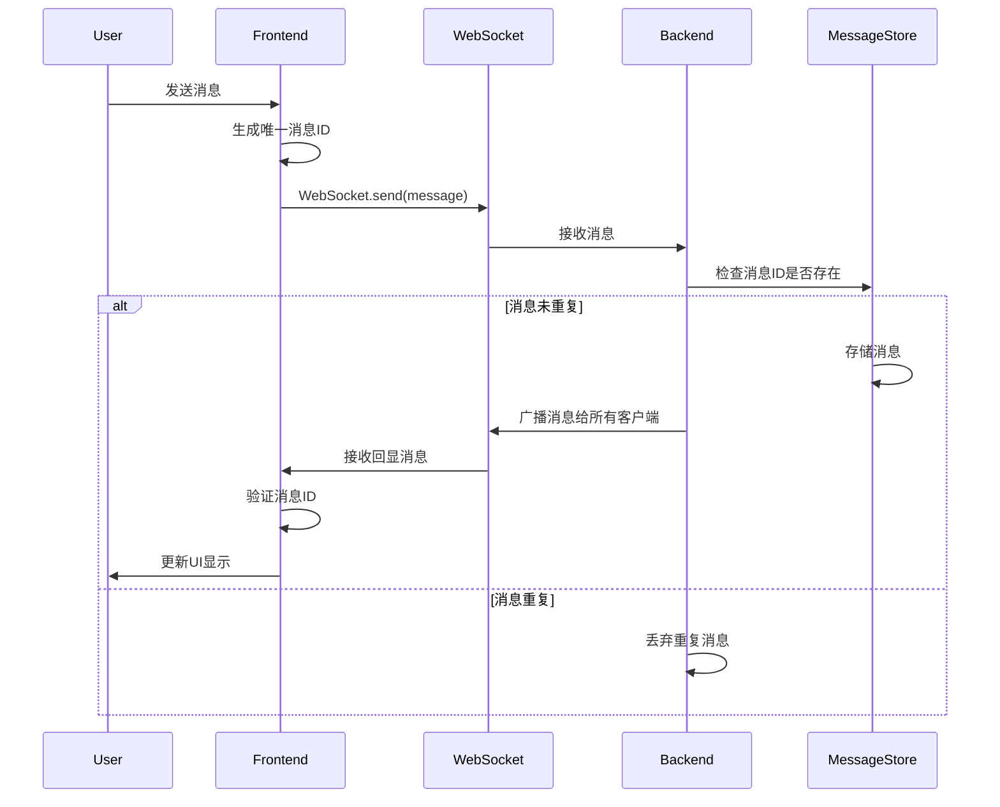
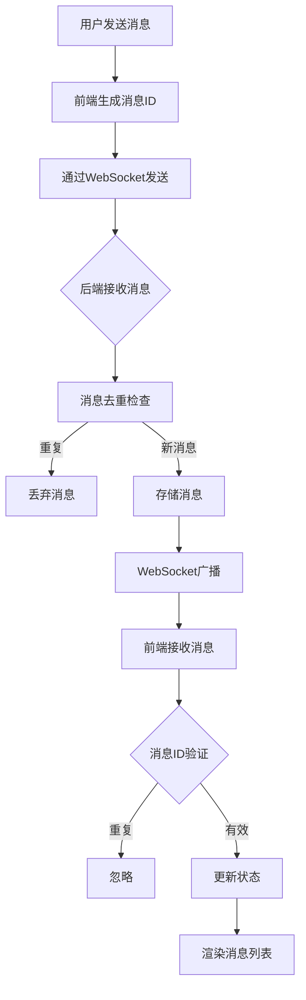

## Product Overview

修复实时对话系统中消息显示缺失的问题，确保用户发送和接收的消息能够正确在界面中呈现。系统采用 WebSocket 进行实时通信，存在消息重复处理导致显示异常的故障。

## Core Features

- WebSocket 消息收发机制修复
- 消息去重逻辑实现
- 事件处理机制优化
- 消息列表实时更新
- 前后端消息链路完整性验证

## Tech Stack

- 通信协议：WebSocket
- 前端框架：React + TypeScript
- 状态管理：Context API / Redux
- 后端：Node.js + Express.js
- 消息队列：内存存储或 Redis

## Tech Architecture

### System Architecture

架构模式：事件驱动架构，基于 WebSocket 的实时通信系统。组件关系为前端 UI 组件 → 状态管理模块 → WebSocket 适配层 → 后端消息服务 → 消息分发器。

### Module Division

- **消息存储模块**：负责消息数据的增删查改和持久化，包含消息队列和数据访问层
- **WebSocket 服务模块**：处理 WebSocket 连接管理、消息接收和广播，依赖消息存储模块
- **事件处理模块**：管理前端事件监听和消息分发，暴露消息更新接口给 UI 组件
- **消息去重模块**：基于消息 ID 的去重逻辑，防止消息重复处理

### Data Flow



### Data Flow Diagram



## Implementation Details

### Core Directory Structure

对于现有项目的消息修复任务，仅展示相关修改文件：

```
project-root/
├── src/
│   ├── components/
│   │   └── ChatMessageList.tsx    # 修改：修复消息显示逻辑
│   ├── services/
│   │   └── websocketService.ts    # 修改：优化消息处理和去重
│   ├── store/
│   │   └── messageStore.ts        # 修改：添加去重机制
│   └── utils/
│       └── messageHelper.ts       # 新增：消息工具函数
└── server/
    └── messageHandler.js          # 修改：后端消息去重逻辑
```

### Key Code Structures

**MessageData Interface**：定义消息实体的核心数据结构，包含消息唯一标识、内容、时间戳和元数据。

```typescript
interface MessageData {
  id: string;              // 唯一消息ID（UUID）
  content: string;         // 消息内容
  senderId: string;        // 发送者ID
  timestamp: number;       // 时间戳
  type: 'text' | 'system'; // 消息类型
}
```

**WebSocketService Class**：WebSocket 服务类，负责连接管理、消息发送和事件监听。实现了消息去重、自动重连和错误处理机制。

```typescript
class WebSocketService {
  connect(): void;
  sendMessage(message: MessageData): void;
  onMessage(callback: (message: MessageData) => void): void;
  disconnect(): void;
}
```

**MessageStore**：消息状态管理类，维护消息列表和去重集合，提供添加消息、获取消息列表等核心方法。

```typescript
class MessageStore {
  private messages: MessageData[] = [];
  private messageIds: Set<string> = new Set();
  
  addMessage(message: MessageData): void;
  getMessages(): MessageData[];
  hasMessage(id: string): boolean;
}
```

### Technical Implementation Plan

1. **问题诊断**：分析现有代码，定位消息丢失和重复处理的根本原因
2. **前端修复**：优化 WebSocket 事件处理，确保消息正确接收和更新 UI
3. **去重机制**：在前后端实现基于消息 ID 的去重逻辑
4. **状态同步**：修复状态管理中的消息更新逻辑
5. **测试验证**：使用 Playwright 验证消息收发功能

### Integration Points

- 前端组件通过 Context API 与 WebSocket 服务通信
- WebSocket 服务使用 JSON 格式与后端交换数据
- 后端消息服务通过事件发射器通知 WebSocket 层
- 消息存储层提供异步 API 供业务逻辑调用

## Agent Extensions

### SubAgent

- **code-explorer**
- Purpose: 搜索和分析项目中消息处理相关的代码文件，定位 WebSocket 通信、消息存储和 UI 渲染逻辑
- Expected outcome: 找到消息链路中的问题代码位置，理解当前实现架构