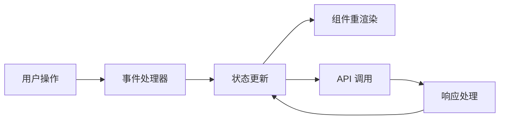

## Product Overview

在前端应用中集成真实的后端 API，实现完整的 Agent 创建和管理功能，替换现有的 Mock 数据。

## Core Features

- Agent 列表展示与管理
- 创建新 Agent
- 编辑现有 Agent
- 删除 Agent
- Agent 详情查看
- Agent 搜索与筛选

## Tech Stack

- 前端框架: React + TypeScript
- 样式方案: Tailwind CSS
- 状态管理: React Context API
- HTTP 客户端: Axios 或 Fetch

## Tech Architecture

### System Architecture

- 架构模式: 分层架构 (展示层、状态管理层、数据层)
- 组件结构: 页面组件 → 功能组件 → 基础 UI 组件
- 数据流: 用户交互 → 状态更新 → 组件重渲染 → API 调用

### Module Division

- **API 服务模块**: 封装所有 Agent 相关的 API 调用
- **状态管理模块**: 使用 Context 管理 Agent 数据状态
- **UI 组件模块**: Agent 列表、表单、卡片等组件

### Data Flow



## Implementation Details

### Core Directory Structure

基于现有项目结构，新增/修改的文件：

```
project-root/
├── src/
│   ├── types/
│   │   └── agent.ts              # 新增: Agent 数据类型定义
│   ├── services/
│   │   └── agentService.ts       # 新增: Agent API 服务封装
│   ├── context/
│   │   └── AgentContext.tsx     # 新增: Agent 状态管理
│   └── pages/
│       └── Agents.tsx            # 新增: Agents 页面组件
```

### Key Code Structures

**AgentData 接口**: 定义 Agent 实体的核心数据结构

```typescript
interface AgentData {
  id: string;
  name: string;
  description: string;
  avatar?: string;
  createdAt: string;
  updatedAt: string;
}
```

**AgentState 类型**: 定义状态管理的数据结构

```typescript
interface AgentState {
  agents: AgentData[];
  loading: boolean;
  error: string | null;
}
```

**AgentService 类**: 封装 Agent 相关的 API 调用

```typescript
class AgentService {
  async createAgent(data: Partial<AgentData>): Promise<AgentData> { }
  async fetchAgents(): Promise<AgentData[]> { }
  async updateAgent(id: string, data: Partial<AgentData>): Promise<void> { }
  async deleteAgent(id: string): Promise<void> { }
}
```

### Technical Implementation Plan

1. **状态管理实现**: 使用 React Context API 创建 AgentContext，提供 agents 状态和操作方法
2. **API 服务集成**: 创建 agentService 封装所有 API 调用，替换 Mock 数据
3. **UI 组件开发**: 构建 Agent 列表页面和创建/编辑表单组件
4. **错误处理**: 实现统一的错误处理和加载状态显示

### Integration Points

- 与现有 API 服务层集成
- 使用现有的 Sessions 页面导航结构
- 与后端 RESTful API 通信，数据格式为 JSON

## Design Style

采用现代简约风格，使用柔和阴影、圆角卡片和微交互动画。界面设计注重清晰的视觉层次和流畅的交互体验，确保响应式布局在不同设备上表现良好。

## Page Planning

1. **Agents 页面**: Agent 列表展示，包含搜索、筛选和创建按钮
2. **Agent 创建/编辑页面**: 表单页面，包含名称、描述、头像上传等字段
3. **Agent 详情页面**: 展示 Agent 详细信息和配置项

## Block Design (Agents 页面)

- **顶部导航栏**: 显示页面标题和用户操作入口
- **搜索筛选区**: 搜索框和分类筛选器
- **Agent 列表区**: 卡片式布局展示所有 Agent
- **创建按钮区**: 悬浮或固定位置的创建按钮
- **底部导航栏**: 切换 Sessions 和 Agents 页面

## Agent Extensions

### Skill

- **frontend-design**
- Purpose: 创建高质量的 Agent 管理 UI 界面
- Expected outcome: 生成美观、可用的 React 组件代码

### SubAgent

- **code-explorer**
- Purpose: 探索现有项目结构和 API 服务代码
- Expected outcome: 理解现有代码库，确定集成点