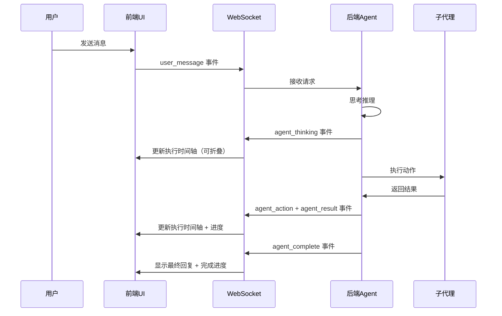

## 产品概述

针对 Agentic 系统进行 P0 级别用户体验改进，解决信息层级混乱、子代理细节难以追踪、执行状态可视化不足、错误处理机制弱等关键问题。

## 核心功能

- **子代理详情可折叠设计**: 将子代理执行详情从主对话区域分离，仅在执行时间轴中展示，支持折叠/展开交互，对话区域仅保留用户消息和最终回复
- **增强错误处理机制**: 错误信息包含错误类型、错误码、详细描述、可能的解决方案和恢复操作建议
- **执行进度可视化**: 添加整体执行进度条、当前步骤高亮、执行耗时统计和步骤完成状态标识
- **优化信息层级**: 对话区域聚焦于用户交互，执行细节集中在时间轴区域，通过颜色和图标区分不同类型的事件

## 技术栈

- **前端框架**: 原生 HTML/CSS/JavaScript（保持现有架构）
- **样式方案**: Tailwind CSS + 自定义样式
- **通信协议**: WebSocket 实时推送
- **后端**: FastAPI + Python

## 技术架构

### 系统架构

保持现有分层架构不变，前端和后端通过 WebSocket 事件流通信，前端负责渲染和交互，后端负责业务逻辑和事件推送。

### 数据流



### 模块划分

#### 前端模块

- **消息渲染模块**: 负责渲染对话区域，仅显示用户消息和最终回复
- **执行时间轴模块**: 负责渲染可折叠的子代理执行详情
- **进度管理模块**: 负责计算和显示整体执行进度、耗时统计
- **错误处理模块**: 负责展示增强的错误信息和恢复建议
- **状态管理模块**: 管理折叠状态、执行状态、错误状态

#### 后端模块

- **事件推送模块**: 扩展 StreamManager，增强事件元数据（进度、耗时、错误详情）
- **错误处理模块**: 统一错误处理，提供错误类型、错误码和恢复建议

## 实现细节

### 核心目录结构

```
agentic/
├── static/
│   ├── index.html          # 修改: 添加进度条容器和折叠按钮
│   ├── app.js              # 修改: 实现折叠逻辑、进度计算、错误增强
│   └── styles.css          # 修改: 添加折叠样式、进度条样式、错误样式
└── src/
    ├── stream_manager.py    # 修改: 增强事件元数据
    ├── agent.py             # 轻微修改: 支持进度回调
    └── error_handler.py     # 新增: 统一错误处理和恢复建议生成
```

### 关键代码结构

#### 前端数据结构

```javascript
// 执行状态
const executionState = {
    currentStep: 0,
    totalSteps: 0,
    startTime: null,
    elapsed: 0,
    progress: 0
};

// 折叠状态
const collapseState = {
    timelineCollapsed: false,
    subagentDetails: {}  // { stepId: boolean }
};

// 错误增强结构
const errorData = {
    type: "NETWORK_ERROR" | "TOOL_ERROR" | "SKILL_ERROR" | "AGENT_ERROR",
    code: "ERR_001",
    message: "错误描述",
    details: "详细错误信息",
    suggestions: ["建议1", "建议2"],
    recoveryActions: ["重试", "查看日志"]
};
```

#### 后端事件结构

```python
# 增强的事件元数据
metadata = {
    # 原有字段
    "action_type": "use_tool",
    "tool_name": "search_google",
    
    # 新增字段
    "step_number": 1,
    "total_steps": 5,
    "progress": 20,
    "start_time": "2026-01-18T10:00:00",
    "elapsed": 2.5,
    "parent_step": None  # 用于嵌套关系
}
```

### 技术实现计划

#### 1. 子代理详情可折叠设计

- **问题**: 当前子代理执行详情混在对话区域
- **方案**: 
- 过滤对话区域中的 thinking/action/result 消息，仅保留 user/assistant/system/error
- 在执行时间轴中为每个子代理步骤添加可折叠详情
- 默认折叠，用户点击展开查看详情
- 添加全局折叠/展开按钮
- **关键实现**: 修改 `addMessage()` 函数，添加消息类型过滤；修改 `addTimelineItem()` 添加折叠交互

#### 2. 错误信息增强

- **问题**: 错误信息简单，缺少解决方案
- **方案**:
- 定义错误类型枚举
- 创建错误码映射表
- 生成错误恢复建议
- 设计错误展示 UI（包含标题、描述、建议、操作按钮）
- **关键实现**: 创建 `error_handler.py`，修改前端 `handleError()` 函数

#### 3. 执行进度可视化

- **问题**: 用户不知道执行进度和耗时
- **方案**:
- 在执行时间轴顶部添加进度条
- 高亮当前正在执行的步骤
- 显示总耗时和单步耗时
- 使用颜色区分步骤状态（进行中、完成、错误、跳过）
- **关键实现**: 添加进度计算逻辑，修改时间轴渲染，添加进度条样式

#### 4. 信息层级优化

- **问题**: 信息层级混乱
- **方案**:
- 对话区域聚焦于用户交互
- 执行时间轴展示详细执行过程
- 使用图标和颜色区分不同类型的事件
- 添加视觉层次（主要信息 vs 详情信息）
- **关键实现**: 调整消息过滤逻辑，优化时间轴样式

### 集成点

- WebSocket 事件协议保持向后兼容
- 新增可选的元数据字段
- 前端兼容旧版本事件，渐进增强新功能

## 技术考量

### 性能优化

- 使用事件委托处理折叠交互
- 虚拟滚动处理大量时间轴项目
- 防抖处理频繁的进度更新
- 缓存 DOM 元素引用

### 安全性

- 输入验证：错误内容转义 XSS 防护
- 错误信息不暴露敏感数据
- 限制时间轴项目数量避免内存溢出

### 可扩展性

- 错误类型和恢复建议可配置
- 进度计算策略可插件化
- 折叠逻辑支持多层嵌套
- 事件元数据字段可扩展

## 技术文档

### 事件协议扩展

**原有事件**（保持不变）:

- user_message
- agent_thinking
- agent_action
- agent_result
- agent_complete
- error

**增强的元数据**（新增可选字段）:

```
{
  "event": "agent_action",
  "content": "执行动作描述",
  "metadata": {
    "action_type": "use_tool",
    "tool_name": "search_google",
    "step_number": 1,
    "total_steps": 5,
    "progress": 20,
    "start_time": "2026-01-18T10:00:00",
    "elapsed": 2.5
  }
}
```

**新增错误详情事件**:

```
{
  "event": "error_enhanced",
  "content": "错误描述",
  "metadata": {
    "error_type": "TOOL_ERROR",
    "error_code": "ERR_TOOL_001",
    "error_details": "详细错误信息",
    "suggestions": ["建议1", "建议2"],
    "recovery_actions": ["重试", "查看日志"]
  }
}
```

## 设计风格

采用现代企业级设计风格，注重信息层级清晰、交互流畅、视觉美观。使用简洁的配色方案，通过颜色和图标区分不同类型的事件，增强可读性和可用性。

## 设计内容描述

### 整体布局

保持左右分栏布局：

- **左侧对话区域**：宽度 60%，仅显示用户消息和最终助手回复，简洁清爽
- **右侧执行时间轴**：宽度 40%，显示执行进度和可折叠的子代理详情

### 对话区域设计

- **消息卡片**：使用圆角卡片设计，用户消息右对齐（蓝色背景），助手消息左对齐（灰色背景）
- **消息类型过滤**：自动隐藏 thinking/action/result 消息，仅显示核心交互消息
- **时间戳**：每条消息右下角显示时间

### 执行时间轴设计

#### 顶部进度条区域

- **整体进度条**：位于时间轴顶部，显示当前执行进度百分比
- **进度指示器**：显示当前步骤（如 "Step 3/10"）
- **耗时统计**：显示总耗时（如 "已用 25s"）
- **颜色编码**：进度条颜色根据状态变化（蓝色-进行中，绿色-成功，红色-错误）

#### 可折叠步骤项

每个步骤包含：

- **步骤头部**：包含步骤图标（思考/动作/结果）、步骤名称、耗时、状态指示器
- **折叠按钮**：点击可展开/收起步骤详情
- **步骤详情**（默认折叠）：
- 完整的执行内容
- 工具/技能调用详情
- 参数和返回值
- 相关元数据（JSON 格式美化展示）

#### 错误展示设计

- **错误卡片**：红色边框卡片，包含错误图标
- **错误类型**：大号加粗显示（如 "TOOL_ERROR"）
- **错误代码**：小号灰色文字（如 "ERR_TOOL_001"）
- **错误描述**：主要错误信息
- **建议列表**：图标 + 文字，可点击的操作建议
- **恢复按钮**：主要操作按钮（如 "重试"、"查看日志"）

### 字体系统

- **标题**: PingFang SC, 16px, 600
- **副标题**: PingFang SC, 14px, 500
- **正文**: PingFang SC, 13px, 400
- **代码/元数据**: SF Mono, 12px, 400

### 颜色系统

- **主色**: #2563EB（蓝色）
- **背景色**: #F9FAFB（主背景）、#FFFFFF（卡片背景）
- **文字色**: #111827（主文字）、#6B7280（次要文字）
- **功能色**: 
- 成功: #10B981（绿色）
- 错误: #EF4444（红色）
- 警告: #F59E0B（黄色）
- 信息: #6366F1（紫色）