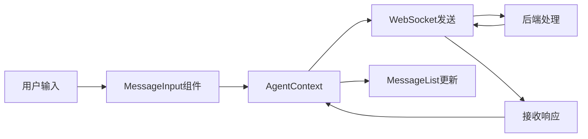

## Product Overview

基于现有前端项目，将Agents页面重构为对话式交互界面。保留现有后端API和WebSocket连接，仅改造前端组件结构和交互逻辑。

## Core Features

- 消息对话界面：展示用户与Agent的对话历史
- 消息输入区域：支持文本输入和发送
- 消息气泡展示：区分用户和Agent的消息样式
- 会话状态管理：保留现有AgentContext和状态逻辑
- 现有API集成：复用现有的WebSocket和HTTP API服务
- 响应式布局：适配不同屏幕尺寸

## Tech Stack

- 前端框架：React + TypeScript（复用现有技术栈）
- 状态管理：复用现有AgentContext
- API通信：复用现有WebSocket和HTTP服务
- 样式方案：Tailwind CSS（如项目已使用）

## Tech Architecture

### 系统架构

- 架构模式：组件化架构（展示层、状态层、服务层）
- 组件结构：App → ConversationalAgentPage → ChatMessageList / MessageInput / ChatHeader
- 数据流：用户输入 → AgentContext状态更新 → WebSocket发送 → 接收响应 → 消息列表更新

### 模块划分

- **对话界面模块**：ConversationalAgentPage主页面组件
- **消息列表模块**：MessageList组件，负责消息展示和滚动
- **输入模块**：MessageInput组件，处理用户输入和发送
- **消息组件**：ChatMessage组件，单条消息渲染
- **API服务模块**：复用现有apiService和WebSocket连接

### 数据流



## 实现细节

### 核心目录结构（修改部分）

```
project-root/
├── src/
│   ├── pages/
│   │   └── Agents.tsx          # 修改：重命名为ConversationalAgentPage
│   ├── components/
│   │   ├── MessageList.tsx     # 新增：消息列表组件
│   │   ├── MessageInput.tsx    # 新增：输入框组件
│   │   └── ChatMessage.tsx     # 新增：单条消息组件
│   ├── contexts/
│   │   └── AgentContext.tsx    # 复用：现有上下文
│   └── services/
│       └── apiService.ts       # 复用：现有API服务
```

### 关键代码结构

**Message数据结构**：

```typescript
interface Message {
  id: string;
  role: 'user' | 'agent';
  content: string;
  timestamp: Date;
}
```

**ConversationalAgentPage组件接口**：

```typescript
interface ConversationalAgentPageProps {
  agentId: string;
}

const ConversationalAgentPage: React.FC<ConversationalAgentPageProps> = ({ agentId }) => {
  // 使用现有AgentContext
  const { messages, sendMessage, isLoading } = useAgentContext();
  // ...
};
```

### 技术实施计划

1. **问题**：将现有Agents页面改造为对话式UI
2. **方案**：创建新的对话组件，复用现有API服务
3. **技术栈**：React + TypeScript + Tailwind CSS
4. **实施步骤**：

- 创建MessageList组件实现消息展示
- 创建MessageInput组件实现输入功能
- 创建ChatMessage组件实现单条消息渲染
- 集成现有AgentContext和WebSocket服务
- 实现自动滚动和响应式布局

5. **测试策略**：手动测试消息发送、接收、滚动和响应式表现

### 集成点

- 与现有AgentContext集成，复用状态管理逻辑
- 与现有WebSocket服务集成，复用实时通信能力
- 与现有API服务集成，复用HTTP请求处理
- 保持现有路由和导航结构

## 设计风格

采用现代对话式UI设计，参考主流聊天应用（如ChatGPT、Claude）的界面风格。使用React + TypeScript + Tailwind CSS + shadcn/ui实现简洁、优雅的对话体验。

## 页面规划

**对话主页面**：

- 顶部栏：Agent名称、状态指示、设置按钮
- 消息区域：可滚动的消息列表，支持自动滚动到底部
- 输入区域：文本输入框、发送按钮，支持多行输入

## 单页面块设计

1. **顶部导航栏**：显示Agent名称和在线状态，右侧设置菜单
2. **消息列表区**：展示历史对话，用户消息右对齐，Agent消息左对齐，包含时间戳
3. **输入区域**：自适应高度输入框，支持回车发送，带发送按钮
4. **欢迎提示**：空状态时显示引导文案，引导用户开始对话

## Agent Extensions

### Skill

- **frontend-design**
- Purpose: 创建高质量的生产级对话式前端界面
- Expected outcome: 生成美观、现代的对话UI组件代码和样式