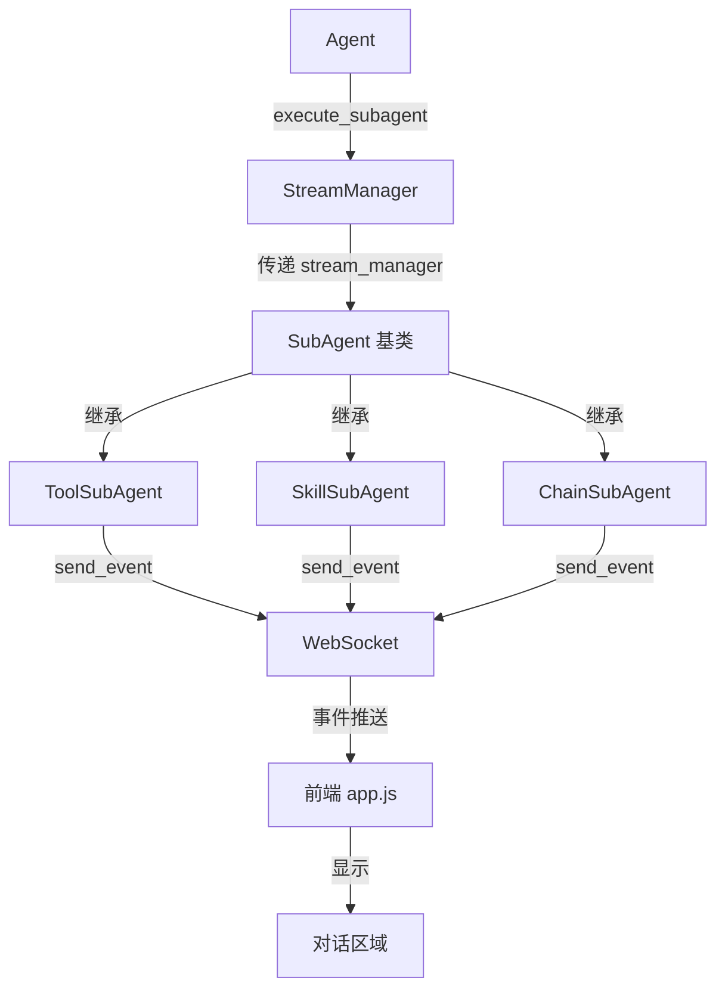
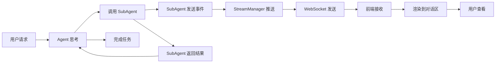

## 产品概述

为 Agentic 系统增加子代理执行细节的实时显示功能，让用户能在前端对话区域看到 Skill、Tool、Chain 子代理执行的每一步细节，包括 AI 思考、工具调用、进度提醒等。

## 核心功能

- 子代理执行过程实时推送：在子代理执行时，将 AI 思考、工具调用、执行进度等详细信息通过 WebSocket 实时发送到前端
- 多级事件类型支持：支持 subagent_thinking、subagent_action、subagent_progress、subagent_error 等事件类型
- 向后兼容设计：保持现有架构不变，子代理在没有 StreamManager 时仍可正常运行（仅控制台输出）
- 统一的事件接口：所有子代理通过统一的接口发送事件，便于前端渲染和状态管理

## 技术栈

- 后端：Python + FastAPI + WebSocket
- 前端：原生 HTML/CSS/JavaScript（已有事件监听机制）
- 数据流：WebSocket 实时事件推送

## 技术架构

### 系统架构



### 模块划分

- **StreamManager 模块**：WebSocket 事件发送管理器，新增子代理事件类型支持
- **Agent 模块**：修改 execute_subagent 方法，将 StreamManager 传递给子代理
- **SubAgent 基类**：新增可选的 stream_manager 参数和 send_event 方法
- **ToolSubAgent 模块**：重构执行逻辑，发送工具调用、执行结果等事件
- **SkillSubAgent 模块**：重构执行循环，发送思考、工具调用、进度等事件
- **ChainSubAgent 模块**：重构链执行逻辑，发送步骤进度、结果等事件

### 数据流



## 实现细节

### 核心目录结构（仅显示修改/新增文件）

```
agentic/
├── src/
│   ├── stream_manager.py          # 修改：新增子代理事件类型
│   ├── agent.py                   # 修改：execute_subagent 传递 StreamManager
│   ├── subagents/
│   │   ├── base.py                # 修改：SubAgent 基类新增 stream_manager 支持
│   │   ├── tool_subagent.py       # 修改：ToolSubAgent 发送执行事件
│   │   ├── skill_subagent.py      # 修改：SkillSubAgent 发送执行事件
│   │   └── chain_subagent.py      # 修改：ChainSubAgent 发送执行事件
```

### 关键代码结构

**SubAgent 基类新增字段**：

```python
class SubAgent(ABC):
    def __init__(self, stream_manager: Optional['StreamManager'] = None):
        self.stream_manager = stream_manager
    
    async def send_event(self, event_type: str, content: str, 
                        metadata: Optional[Dict[str, Any]] = None):
        """可选的事件发送方法"""
        if self.stream_manager:
            await self.stream_manager.send_event(event_type, content, metadata)
```

**事件类型定义**：

- `subagent_start`: 子代理开始执行
- `subagent_thinking`: 子代理 AI 思考过程
- `subagent_action`: 子代理执行动作
- `subagent_progress`: 执行进度
- `subagent_complete`: 子代理完成
- `subagent_error`: 子代理错误

### 技术实现计划

#### 问题 1：子代理无法访问 StreamManager

**解决方案**：通过依赖注入，在创建子代理时传递 StreamManager 实例

1. 修改 SubAgent 基类构造函数，新增可选的 stream_manager 参数
2. 修改 Agent.execute_subagent()，在创建子代理时传入 StreamManager
3. 所有子代理通过基类的 send_event() 方法发送事件

#### 问题 2：子代理执行细节实时推送

**解决方案**：在子代理执行的关键节点发送事件

1. ToolSubAgent：在工具调用前后发送事件
2. SkillSubAgent：在每个执行步骤、工具调用、AI 思考时发送事件
3. ChainSubAgent：在每个链步骤执行时发送事件

#### 问题 3：向后兼容性

**解决方案**：stream_manager 参数为可选

1. 子代理可以独立运行（无 StreamManager 时正常执行）
2. send_event() 方法内部检查 stream_manager 是否存在
3. 保留现有的 print() 输出作为降级方案

### 集成点

- Agent → StreamManager：通过构造函数传递
- StreamManager → WebSocket：使用现有 send_event() 方法
- SubAgent → StreamManager：通过基类的 send_event() 方法
- 前端 app.js：无需修改，已支持通用事件监听

## 技术考虑

### 日志

- 保留现有的 print() 输出作为控制台日志
- WebSocket 事件作为前端实时展示
- 两种日志并存，不互相干扰

### 性能优化

- 事件批量发送：对于高频事件（如 AI 思考流式输出），保持现有流式机制
- 避免重复发送：确保每个执行步骤只发送一次事件
- 前端节流：前端已有事件累积机制，避免 DOM 过度渲染

### 安全措施

- 输入验证：确保发送到 WebSocket 的内容经过基本转义
- 错误隔离：子代理事件发送失败不应影响主流程执行
- 资源清理：确保 WebSocket 连接异常时不会阻塞子代理执行

### 可扩展性

- 事件类型易于扩展：在 StreamManager 中新增事件类型即可
- 子代理类型易扩展：新增子代理只需继承基类并调用 send_event()
- 前端渲染独立：前端可根据事件类型动态渲染不同样式