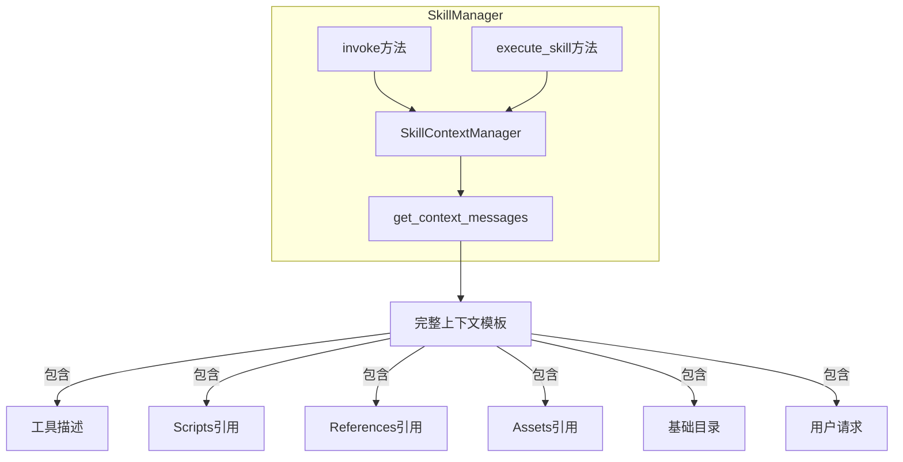

## 产品概述

重构 `skills/manager.py` 中的 `execute_skill` 方法，使其使用 `SkillContextManager` 替代手动构建上下文，消除重复逻辑，恢复丢失的 Skill 功能。

## 核心功能

- 使用 `SkillContextManager.get_context_messages()` 替代手动构建的上下文
- 恢复 Skill 的工具描述（tool descriptions）功能
- 恢复 Skill 的 scripts/references/assets 引用功能
- 消除 `execute_skill` 中的重复代码（264-288 行的手动上下文构建）
- 确保与 `invoke` 方法的上下文构建逻辑一致

## 技术栈

- Python 3.x
- 现有项目架构（Skills Manager + Context Manager）

## 技术架构

### 系统架构

重构将统一上下文构建逻辑，使 `invoke` 和 `execute_skill` 都使用 `SkillContextManager`：



### 模块划分

- **SkillContextManager**: 上下文模板生成器（保持不变）
- **SkillManager.execute_skill**: 重构以使用 SkillContextManager
- **SkillManager.invoke**: 保持不变（已正确使用）

### 数据流

```
Skill.execute_skill 调用
    ↓
过滤工具 (filter_allowed_tools)
    ↓
获取上下文 (SkillContextManager.get_context_messages)
    ↓
注入到 ContextManager
    ↓
LLM 执行循环
```

## 实现细节

### 核心目录结构

```
src/skills/
├── manager.py          # 修改: execute_skill 方法
├── context.py          # 不变: SkillContextManager
└── models.py           # 不变: 数据模型
```

### 关键代码结构

**execute_skill 重构点**：

1. 删除 254-288 行的手动上下文构建代码
2. 添加调用 `SkillContextManager.get_context_messages()`
3. 将返回的 messages 注入到 ContextManager

**重构前（254-288行）**：

```python
# 手动构建上下文
context = ContextManager(...)
context.add_system_prompt(skill.content)
context_vars = f"""---\n## Context Variables\n..."""
context.add_system_prompt(context_vars)
```

**重构后**：

```python
# 使用 SkillContextManager 生成完整上下文
context_messages = self.context_manager.get_context_messages(
    skill, user_request, filtered_tools
)
for msg in context_messages:
    if msg.get("meta"):
        context.add_system_prompt(msg["content"])
    else:
        context.add_assistant_response(msg["content"])
```

### 技术实施计划

1. **删除重复代码**: 移除 `execute_skill` 中 264-288 行的手动上下文构建
2. **调用 SkillContextManager**: 使用 `get_context_messages()` 获取完整上下文
3. **注入上下文**: 将 messages 正确注入到 ContextManager
4. **保持行为一致**: 确保 LLM 执行循环不受影响
5. **测试验证**: 验证工具描述、资源引用功能恢复

### 集成点

- `SkillContextManager.get_context_messages()` 返回的 messages 格式已定义（224-261行）
- ContextManager 的 `add_system_prompt` 和 `add_assistant_response` 方法保持不变
- `invoke` 方法已使用相同模式，可保持一致性

## 技术考量

### 日志

保持现有的打印日志格式，调试信息保持一致

### 性能优化

无需额外优化，重构后减少重复代码，可能略微提升性能

### 安全措施

工具过滤逻辑保持不变（`filter_allowed_tools`）

### 可扩展性

统一使用 SkillContextManager 后，未来添加新的上下文内容只需修改一处

# Agent Extensions

无需使用任何 Agent Extensions，这是一个纯代码重构任务